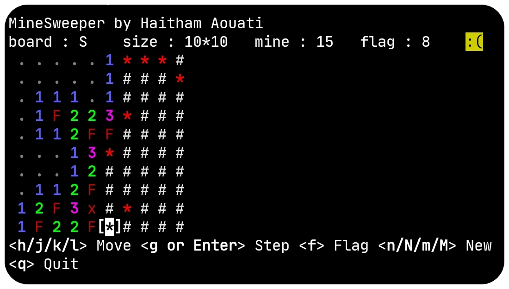

# MineSweeper
**MineSweeper** game in bash scripting for Termux.



## Install

To use the MineSweeper script, follow these steps:

1. Clone the repository:

    ```
    git clone https://github.com/haithamaouati/MineSweeper.git
    ```

2. Change to the MineSweeper directory:

    ```
    cd MineSweeper
    ```
    
3. Change the file modes
    ```
    chmod +x minesweeper.sh
    ```
    
5. Run the script:

    ```
    ./minesweeper.sh
    ```

## Usage

Usage: `./minesweeper.sh`

##### Options:

Key | Command
--- | ---
key | board   size   mines
n | Small   10*10  15
N | Medium  15*15  33
m | Large   20*20  60
M | Extra   30*20  90 
r | redraw the board
q | quit the script

## Dependencies

The script requires the following dependencies:

- **ncurses-utils**: `pkg install ncurses-utils - y`

Make sure to install these dependencies before running the script.

## Environment

- Tested on [Termux]()

## License

MineSweeper is licensed under [WTFPL license](LICENSE).
